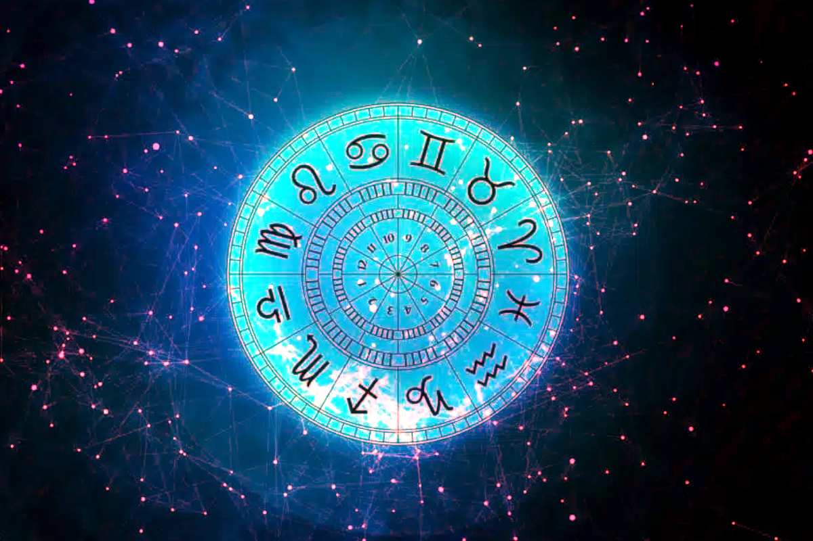

<html>
<html lang="pt-br">
  <head>
    <meta http-equiv="Content-Type" content="text/html; charset=UTF-8">
    <meta name="viewport" content="width=device-width, initial-scale=1, maximum-scale=1.0">
    <meta name="robots" content="max-image-preview:large">
  	<link rel="icon" href="https://images.emojiterra.com/google/noto-emoji/v2.034/128px/1f468-1f3fb-1f4bb.png" sizes="32x32">
    <link rel="stylesheet" href="https://use.fontawesome.com/releases/v5.0.7/css/all.css">
    
    <link rel="preconnect" href="https://fonts.googleapis.com">
    <link rel="preconnect" href="https://fonts.gstatic.com" crossorigin>
    <link href="https://fonts.googleapis.com/css2?family=Nunito:wght@200&family=Playfair+Display&display=swap" rel="stylesheet">
    <title></title>
    <!-- estilo integrado para github pages-->
    
    <body>
      <nav>
        
          <ul>
            <li class="active"><a href="https://blogoficialvr.netlify.app/">Blog Home</a></li>
            <li><a href="https://vitordev01.netlify.app/">Sobre Min</a></li>
            <li><a href="https://www.instagram.com/vitorkw89/">Instagram </a></li>
            <li><a href="mailto:victorskw89@gmail.com">Feedback</a></li>
            <li><a href="https://astrologia-tarot.netlify.app/">Serviços</a></li>
            
            
             
             
            <h1 style="color: #fff; font-size: 10px;">bem vindo(a) ao blog! boa leitura.
            Última Atualização em 28/03/23</h1>
          </ul>
          <label id="icon">
            <i class="fa fa-bars" aria-hidden="true"></i>
          </label>
      </nav>
       
      <!-- seções de cada página do blog-->
      <section class="blog">

        

            <!-- Página 1-->
            

                

                    
                   
                

                

                    <h3>Whitney Houston Análise Mapa Natal</h3>
                    
Interpretação da casa astrológica de saúde da cantora e seus desafios com as drogas... • 28/03/2023 <mark>#mapanatal #leão #peixes #WhitneyHouston #saúde</mark>

                    <a href="https://vitordev01.github.io/pagina-blog-4/" class="btn">Ler Mais</a>
                

            

            <!-- Página 2-->
            

                

                    
                    
                

                

                    <h3>Astrologia E A Geração Z</h3>
                    
Uma geração tão tecnológica mas também a mais depressiva, veja as influências dos planetas geracionais na astrologia... 01/03/2023 • <mark>#1990 #2000 #netuno #urano #aquário</mark>

                    <a href="https://vitordev01.github.io/pagina-asteologia-saudemental/" class="btn">Ler Mais</a>
                

            

            
            <!-- Página 3-->
            

                

                    
                    
                

                

                    <h3>Lutero E Seu Signo Escorpião ♏🦂</h3>
                    
A ligação de Matinho Lutero e seu signo e suas profundas características e mudanças na Reforma Protestante...  06/12/2022 • <mark>#escorpião #religião #séculoXVI</mark>

                    <a href="https://vitordev01.github.io/pagina-reforma-protestante/" class="btn">Ler Mais</a>
                

            

            <!-- Página 4-->
            

                

                    
                    
                

                

                    <h3>Os 12 Signos Do Zodíaco </h3>
                    
As principais características dos signos e suas coligações com outros temas... • 01/12/2022 <mark>#astrologia #personalidade #individualidade #signos</mark>

                    <a href="https://vitordev01.github.io/pagina-signos-curso/" class="btn">Leia Mais</a>
                

            

            <!-- 
            

                

                    
                    <h3><i class="fas fa-heart"></i> 50</h3>
                

                

                    <h3>Do You Want Your Blog To Stand Alone Or Support Another Site?</h3>
                    
Lorem ipsum, dolor sit amet consectetur adipisicing elit. Eaque, odit!

                    <a href="#" class="btn">read more</a>
                

            

            

                

                    
                    <h3><i class="fas fa-heart"></i> 40</h3>
                

                

                    <h3>Do You Want Your Blog To Stand Alone Or Support Another Site?</h3>
                    
Lorem ipsum, dolor sit amet consectetur adipisicing elit. Eaque, odit!

                    <a href="#" class="btn">read more</a>
                

            

        
 -->
    </section>
     <!-- roda pé da página -->
    <footer>
        

          <h3>© Vitor Oliveira 2023</h3>
         
        

      </footer>
      <!-- Script para Fazer o menu funcionar-->
      
    </body>
</html>
